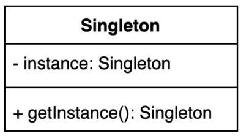

# 싱글톤 패턴

## 인스턴스를 오직 한개만 제공하는 클래스

- 시스템 런타임, 환경 세팅에 대한 정보 등, 인스턴스가 여러개 일 때 문제가 생길 수 있는 경우가 있다.
- 인스턴스를 오직 한개만 만들어 제공하는 클래스가 필요하다.

### 싱글톤 (Singleton) 패턴 구현 방법 1

private 생성자에 static 메소드 [8줄](./Settings1.java)

- 생성자를 private으로 만든 이유?
    - 해당 클래스를 새로 생성할 수 없게 만들기 위함
- getInstance() 메소드를 static으로 선언한 이유?
    - 생성자를 private으로 제한해두었기 때문에 인스턴스화하기 전 호출할 수 있는 것이 없으므로 static 메소드로 제공
- getInstance()가 멀티쓰레드 환경에서 안전하지 않은 이유?
    - getInstance() 안에 객체를 생성하는 로직이 있음
    - 여러 쓰레드가 동시에 점유할 수 있으므로 thread-safe 하지 않음

### 싱글톤 (Singleton) 패턴 구현 방법 2

동기화(synchronized)를 사용해 멀티쓰레드 환경에 안전하게 만드는 방법

- 자바의 동기화 블럭 처리 방법은?
    - synchronized 키워드 사용 [12줄](./Settings2.java)
- getInstance() 메소드 동기화시 사용하는 락(lock)은 인스턴스의 락인가 클래스의 락인가?
    - 클래스 락이다.
- 그 이유는?
    - static 키워드가 들어갔기 때문
    - static이 없다면 인스턴스를 생성한 후에 작동할 수 있으니 인스턴스락이다.

### 싱글톤 (Singleton) 패턴 구현 방법 3

이른 초기화 (eager initialization)을 사용하는 방법

- 이른 초기화가 단점이 될 수도 있는 이유?
    - 객체를 사용하지 않을 경우도 있을텐데, 이른 초기화로 인해 항상 객체가 생성되어 있음
- 만약에 생성자에서 checked 예외를 던진다면 이 코드를 어떻게 변경해야 할까요?
    - static block을 만들고 try/catch를 통해 핸들링 [13줄](./Settings6.java)

### 싱글톤 (Singleton) 패턴 구현 방법 4

double checked locking으로 효율적인 동기화 블럭 만들기 [8줄, 13줄](./Settings3.java)

- double check locking이라고 부르는 이유?
    - getInstance() 에서 싱글톤 객체의 null 체크를 한 후 실제 객체를 할당하는 곳에 synchronized 블럭을 통해 다시한번 null체크를 하기 때문
    - 기존과 다른 부분은 null체크하는 것은 동기화블록으로 하지 않고 실제 객체를 만드는 곳에 동기화블럭을 만들고 null 체크를 하는 것이 다름
    - 객체 생성 이후에는 동기화 블록이 활성화 되지 않기 때문에 오버헤드 발생하지 않음
- instacne 변수는 어떻게 정의해야 하는가?
    - volatile 키워드를 넣어야 함
- 그 이유는?
    - 첫번째 스레드가 instance를 생성하고 synchronized 블록을 벗어남. (working memory 에 생성)
    - 두번째 스레드가 synchronized 블록에 들어와서 null 체크를 하는 시점에서,
    - 첫번째 스레드에서 생성한 instance 가 working memory 에만 존재하고 main memory 에는 존재하지 않을 경우 (working memory -> main memory 동기화 이전)
    - 또는, main memory 에 존재하지만 두번째 스레드의 working memory 에 존재하지 않을 경우 (두번째 쓰레드(working memory)에서 main memory 동기화를 못한 경우)
    - 즉, 메모리간 동기화가 완벽히 이루어지지 않은 상태라면 **두번째 스레드는 인스턴스를 또 생성하게 된다.**

### 싱글톤 (Singleton) 패턴 구현 방법 5

static inner 클래스를 사용하는 방법 [10줄](./Settings4.java)

- 이 방법은 static final를 썼는데도 왜 지연 초기화 (lazy initialization)라고 볼 수 있는가?
    - 클래스가 로드될 때 인스턴스가 생성되므로, getInstance() 를 호출하기 전에는 클래스도 로드되지 않고 인스턴스도 생성되지 않는다.
    - 즉, 클래스에 static inner class 가 있고 static 필드에 대한 접근이 이루어지면 클래스가 로드된다.
    - 핵심은 Singleton class 가 로드 될 때 inner class 는 호출되기 전까지 로드되지 않기 때문에 Lazy init 이라고 볼 수 있다.